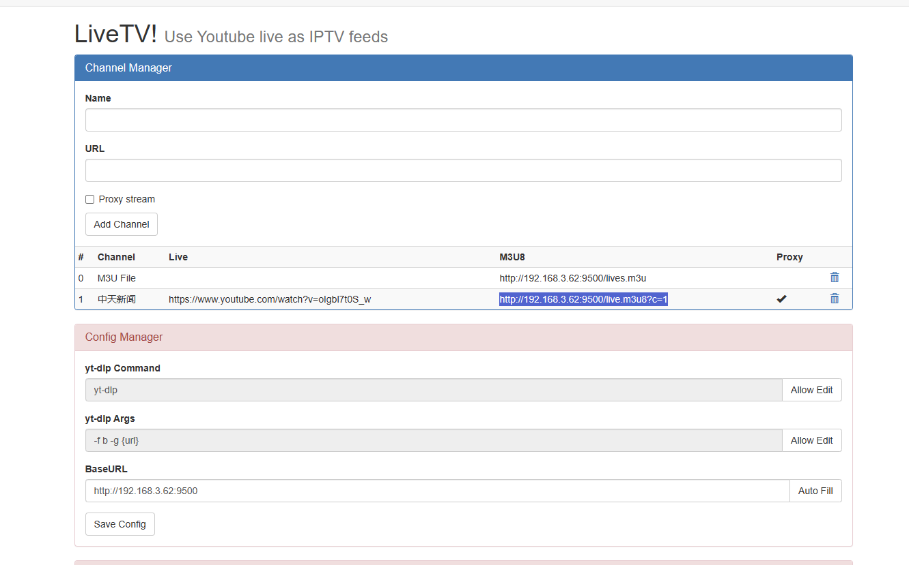

# LiveTV
Use Youtube live as IPTV feeds

## Install 

First you need to install Docker, Centos7 users can directly use the following tutorials. [How To Install and Use Docker on CentOS 7](https://www.digitalocean.com/community/tutorials/how-to-install-and-use-docker-on-centos-7)

After installing Docker, you can enable LiveTV! on your local port 9500 with the following command:

`docker run -d -p9500:9000 juestnow/livetv:main`

The data file is stored inside the container in the `/root/data` directory, so it is recommended to use the -v command to map this directory to the host's directory.

An example of using an external storage directory is shown below.

`docker run -d --name youtube --restart=always -p9500:9000  -v/mnt/data/livetv:/root/data juestnow/livetv:main`

This will open a LiveTV! container on port 9500 that uses the `/mnt/data/livetv` directory as storage.

PS: If you do not specify an external storage directory, LiveTV! will not be able to read the previous configuration file when it reboots.

## Usage

Default password is "password".

First you need to know how to access your host from the outside, if you are using a VPS or a dedicated server, you can visit `http://your_ip:9500` and you should see the following screen.



First of all, you need to click "Auto Fill" in the setting area, set the correct URL, then click "Save Config".

Then you can add a channel. After the channel is added successfully, you can play the M3U8 file from the address column.

When you use Kodi or similar player, you can consider using the M3U file URL in the first row to play, and a playlist containing all the channel information will be generated automatically.

yt-dlp document here => [https://github.com/yt-dlp/yt-dlp](https://github.com/yt-dlp/yt-dlp)

Document Translate by [DeepL](https://www.deepl.com/zh/translator)

nginx proxy set

```nginx
upstream  youtube {
        least_conn;
        server 127.0.0.1:9000 max_fails=3 fail_timeout=30s resolve;
        keepalive 1000;
}

server {
    listen 80;
    server_name www.xxx.com;
     location / {
        proxy_pass http://youtube;
        proxy_redirect     off;
        proxy_set_header   Host $host;
        proxy_set_header   X-Real-IP    $remote_addr;
        proxy_set_header   X-Forwarded-For  $proxy_add_x_forwarded_for;
        proxy_next_upstream error timeout invalid_header http_502 http_503 http_504;
        proxy_max_temp_file_size 0;
        proxy_connect_timeout      90;
        proxy_send_timeout         90;
        proxy_read_timeout         90;
        proxy_buffer_size          4k;
        proxy_buffers              4 32k;
        proxy_busy_buffers_size    64k;
        proxy_temp_file_write_size 64k;
        proxy_http_version 1.1;
        proxy_set_header Accept-Encoding "";
   }
}
```